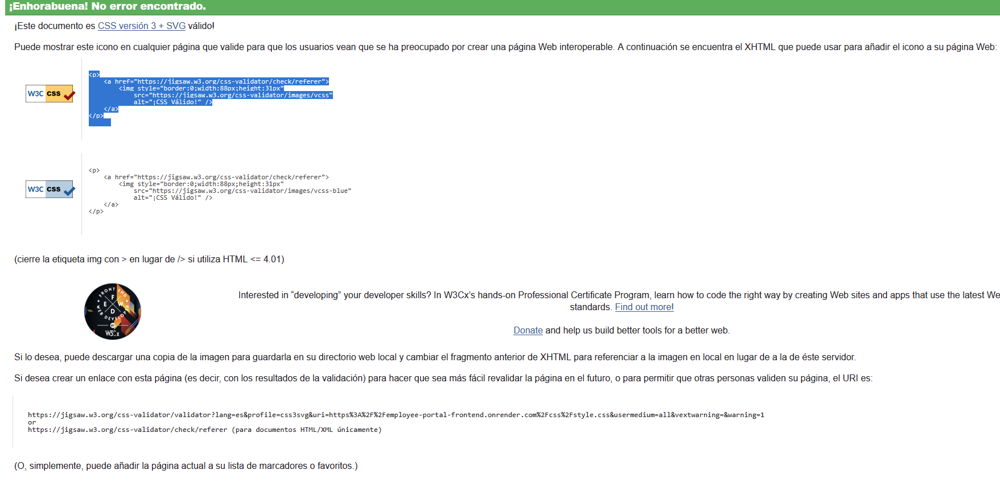
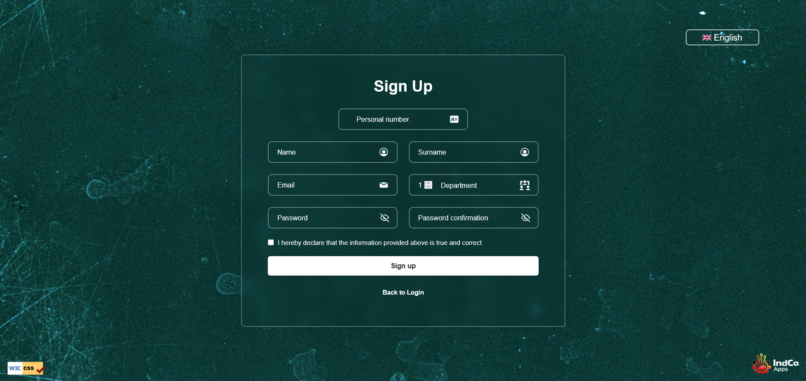
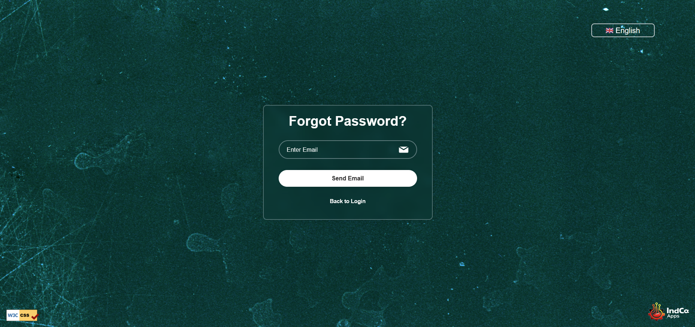
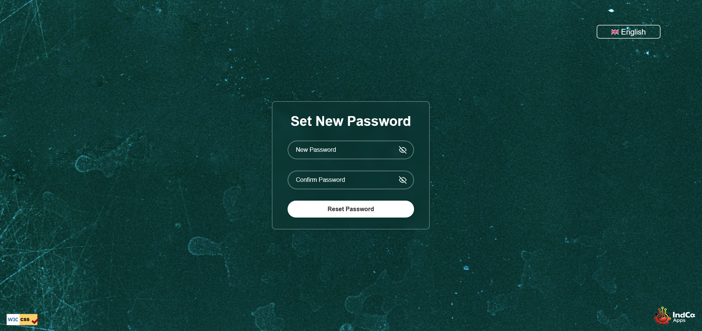
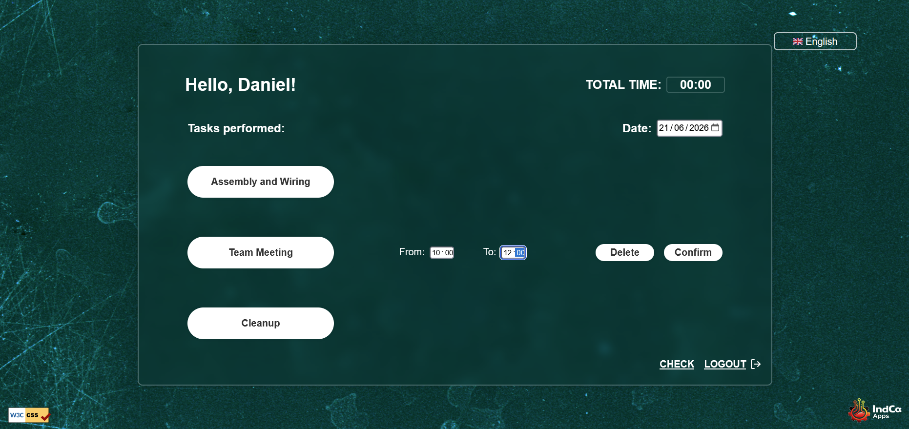
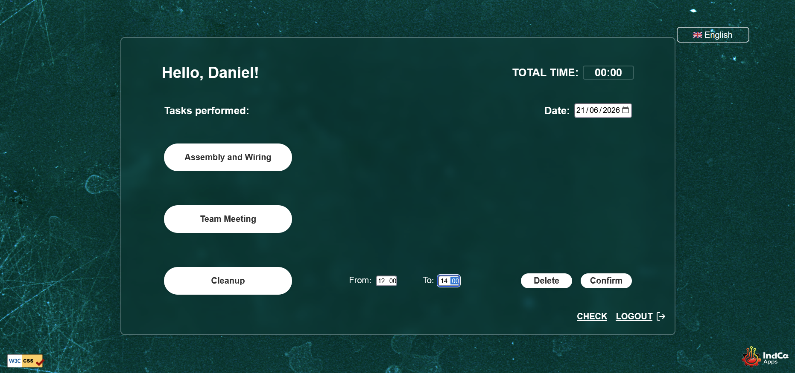
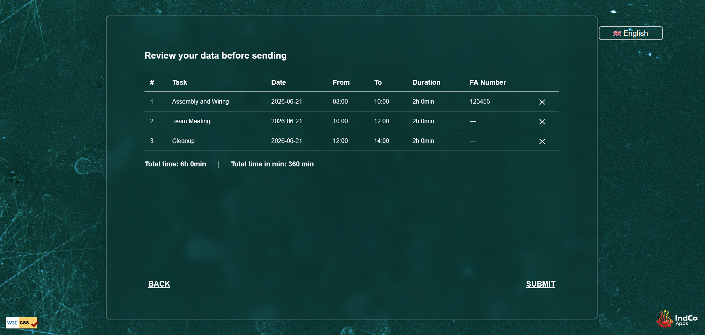
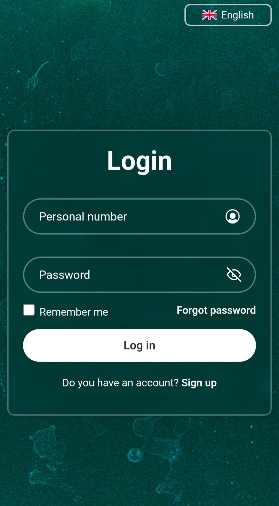
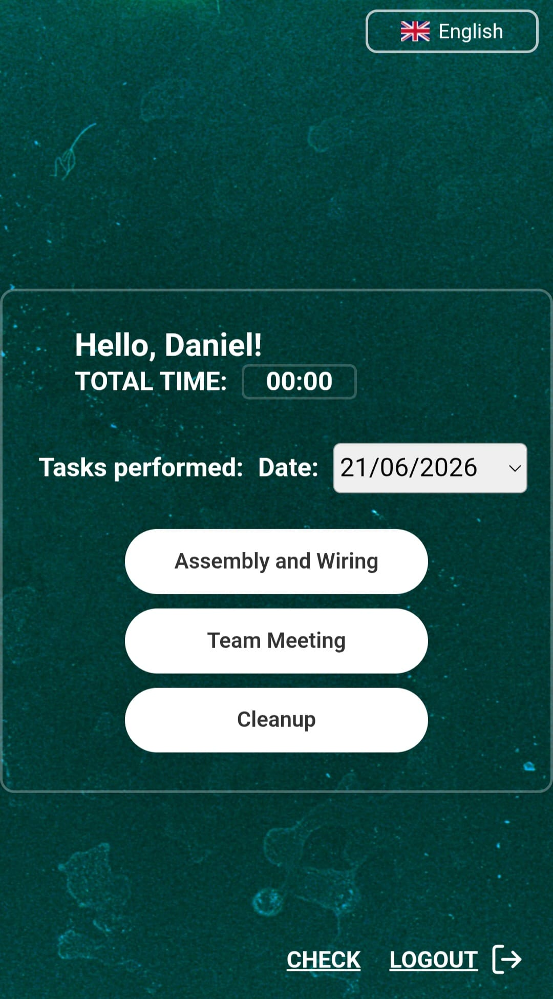

# Employee Task Register

🌐 [English](#english) | [Español](#español) | [Deutsch](#deutsch)

---

## English

### Description

A web application designed for production industry companies that allows employees to register their daily tasks and working hours. Flexible and adaptable — task names can be customised to fit any company's workflow.

### Live Demo

[Try the app here](https://employee-portal-frontend.onrender.com)

### Built With

- **Languages:** Java, JavaScript, CSS, HTML, SQL
- **Framework:** Spring Boot
- **Database:** PostgreSQL (Neon)
- **Deployment:** Render
- **Other:** JSON, BCrypt, Resend

### Features

- User registration and login with redirect to the worker view
- "Forgot password" flow: email with a secure reset link/token
- Language selector with flag icons (7 languages: English, Spanish, German, Portuguese, Galician, Catalan, Basque)
- Responsive design with media queries for mobile and tablet
- Custom +/- buttons for the department field, optimised for touch on mobile
- Personalised greeting for each worker after login
- Date picker to log hours for any specific day
- Task registration (Assembly, Team Meeting, Cleanup) with time validation:
  - End time cannot be earlier than start time
  - Overlap checks against both in-memory entries and the database
- Review screen ("Check") to verify, edit or delete entries before submitting
- Submit is blocked if there are no tasks to send
- Logout is blocked if there are unsubmitted tasks pending review
- Passwords hashed with BCrypt before being stored
- "Remember me" stores the personal number locally for faster login

### Screenshots

**Desktop**

Login

Sign Up

Forgot Password

Reset Password

Worker View

Worker View — Task Entry

Check View

**Mobile**

Login

Worker View

### Running Locally

1. Clone the repository:

git clone https://github.com/DaniRCarou/WS_WEB.git

2. Switch to the `production` branch:

git checkout production

3. Install PostgreSQL and create a database
4. Update the credentials in `application.properties`
5. Open the `BACKEND` folder in IntelliJ and run `EmployeeInformationManagementApplication.java`
6. Open the `FRONTEND` folder in VS Code
7. Right-click on `index.html` and select "Open with Live Server"
8. The app will be available at `http://127.0.0.1:5500/frontend/index.html`

### About the Author

**Daniel Rodríguez Carou**

Industrial maintenance technician with 19 years of experience, now transitioning into software development as a Junior Java Developer.

- GitHub: [DaniRCarou](https://github.com/DaniRCarou)
- LinkedIn: [danicarou](https://linkedin.com/in/danicarou)
- Email: danicarou.dev@gmail.com

---

## Español

### Descripción

Una aplicación web diseñada para empresas del sector industrial que permite a los empleados registrar sus tareas diarias y horas de trabajo. Flexible y adaptable — los nombres de las tareas se pueden personalizar para adaptarse al flujo de trabajo de cualquier empresa.

### Demo en vivo

[Prueba la app aquí](https://employee-portal-frontend.onrender.com)

### Tecnologías

- **Lenguajes:** Java, JavaScript, CSS, HTML, SQL
- **Framework:** Spring Boot
- **Base de datos:** PostgreSQL (Neon)
- **Despliegue:** Render
- **Otros:** JSON, BCrypt, Resend

### Funcionalidades

- Registro e inicio de sesión con redirección a la vista del trabajador
- Flujo de "contraseña olvidada": email con enlace/token seguro de restablecimiento
- Selector de idioma con banderas (7 idiomas: inglés, español, alemán, portugués, gallego, catalán, euskera)
- Diseño responsive con media queries para móvil y tablet
- Botones +/- personalizados para el campo de departamento, optimizados para táctil en móvil
- Saludo personalizado para cada trabajador tras iniciar sesión
- Selector de fecha para registrar horas de cualquier día concreto
- Registro de tareas (Montaje, Reunión de equipo, Limpieza) con validación de horarios:
  - La hora de fin no puede ser anterior a la de inicio
  - Comprobación de solapamiento tanto en memoria como en la base de datos
- Pantalla de revisión ("Check") para verificar, editar o eliminar entradas antes de enviarlas
- El envío se bloquea si no hay tareas que enviar
- El cierre de sesión se bloquea si hay tareas pendientes de revisar
- Contraseñas encriptadas con BCrypt antes de guardarse
- "Recordarme" guarda el número personal localmente para un inicio de sesión más rápido

### Capturas de pantalla

**Escritorio**

Login

Registro

Contraseña olvidada

Restablecer contraseña

Vista del trabajador

Vista del trabajador — Registro de tarea

Vista de revisión

**Móvil**

Login

Vista del trabajador

### Ejecutar en local

1. Clona el repositorio:

git clone https://github.com/DaniRCarou/WS_WEB.git

2. Cambia a la rama `production`:

git checkout production

3. Instala PostgreSQL y crea una base de datos
4. Actualiza las credenciales en `application.properties`
5. Abre la carpeta `BACKEND` en IntelliJ y ejecuta `EmployeeInformationManagementApplication.java`
6. Abre la carpeta `FRONTEND` en VS Code
7. Haz clic derecho sobre `index.html` y selecciona "Open with Live Server"
8. La app estará disponible en `http://127.0.0.1:5500/frontend/index.html`

### Sobre el autor

**Daniel Rodríguez Carou**

Técnico de mantenimiento industrial con 19 años de experiencia, actualmente en transición hacia el desarrollo de software como Junior Java Developer.

- GitHub: [DaniRCarou](https://github.com/DaniRCarou)
- LinkedIn: [danicarou](https://linkedin.com/in/danicarou)
- Email: danicarou.dev@gmail.com

---

## Deutsch

### Beschreibung

Eine Webanwendung für Unternehmen der Produktionsindustrie, mit der Mitarbeiter ihre täglichen Aufgaben und Arbeitsstunden erfassen können. Flexibel und anpassbar — die Aufgabennamen können an den Arbeitsablauf jedes Unternehmens angepasst werden.

### Live-Demo

[App hier testen](https://employee-portal-frontend.onrender.com)

### Technologien

- **Sprachen:** Java, JavaScript, CSS, HTML, SQL
- **Framework:** Spring Boot
- **Datenbank:** PostgreSQL (Neon)
- **Deployment:** Render
- **Weitere:** JSON, BCrypt, Resend

### Funktionen

- Registrierung und Login mit Weiterleitung zur Arbeiteransicht
- "Passwort vergessen"-Funktion: E-Mail mit sicherem Reset-Link/Token
- Sprachauswahl mit Flaggen-Icons (7 Sprachen: Englisch, Spanisch, Deutsch, Portugiesisch, Galicisch, Katalanisch, Baskisch)
- Responsives Design mit Media Queries für Mobilgeräte und Tablets
- Individuelle +/- Schaltflächen für das Abteilungsfeld, optimiert für Touch-Bedienung auf Mobilgeräten
- Personalisierte Begrüßung für jeden Mitarbeiter nach dem Login
- Datumsauswahl zur Erfassung von Stunden für jeden beliebigen Tag
- Aufgabenerfassung (Montage, Teambesprechung, Reinigung) mit Zeitvalidierung:
  - Die Endzeit darf nicht vor der Startzeit liegen
  - Überschneidungsprüfung sowohl im Arbeitsspeicher als auch in der Datenbank
- Übersichtsbildschirm ("Check") zum Prüfen, Bearbeiten oder Löschen von Einträgen vor dem Absenden
- Das Absenden wird blockiert, wenn keine Aufgaben zum Senden vorhanden sind
- Der Logout wird blockiert, wenn noch nicht überprüfte Aufgaben ausstehen
- Passwörter werden vor der Speicherung mit BCrypt gehasht
- "Angemeldet bleiben" speichert die Personalnummer lokal für einen schnelleren Login

### Screenshots

**Desktop**

Login

Registrierung

Passwort vergessen

Passwort zurücksetzen

Arbeiteransicht

Arbeiteransicht — Aufgabenerfassung

Übersichtsansicht

**Mobil**

Login

Arbeiteransicht

### Lokale Ausführung

1. Repository klonen:

git clone https://github.com/DaniRCarou/WS_WEB.git

2. Zum `production`-Branch wechseln:

git checkout production

3. PostgreSQL installieren und eine Datenbank erstellen
4. Zugangsdaten in `application.properties` aktualisieren
5. Den Ordner `BACKEND` in IntelliJ öffnen und `EmployeeInformationManagementApplication.java` ausführen
6. Den Ordner `FRONTEND` in VS Code öffnen
7. Rechtsklick auf `index.html` und "Open with Live Server" auswählen
8. Die App ist verfügbar unter `http://127.0.0.1:5500/frontend/index.html`

### Über den Autor

**Daniel Rodríguez Carou**

Industrieller Wartungstechniker mit 19 Jahren Erfahrung, derzeit im Übergang zur Softwareentwicklung als Junior Java Developer.

- GitHub: [DaniRCarou](https://github.com/DaniRCarou)
- LinkedIn: [danicarou](https://linkedin.com/in/danicarou)
- Email: danicarou.dev@gmail.com